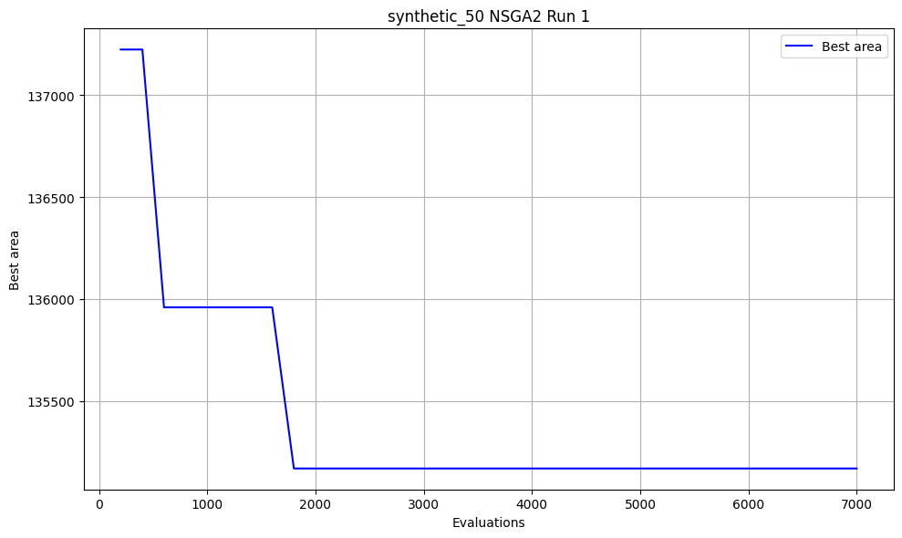
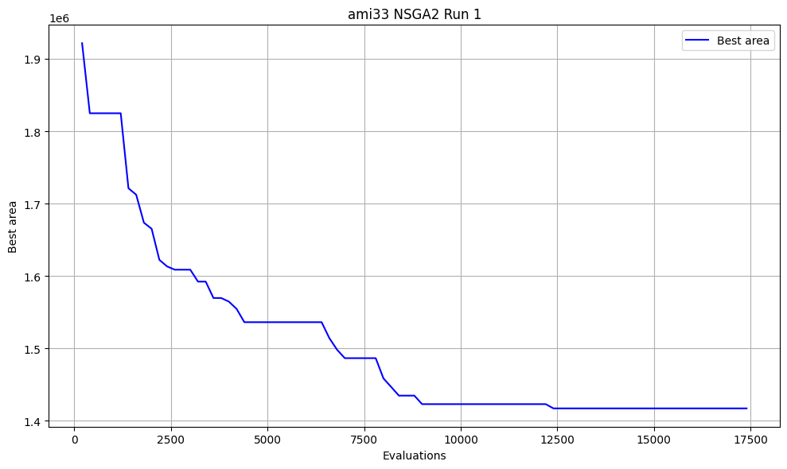
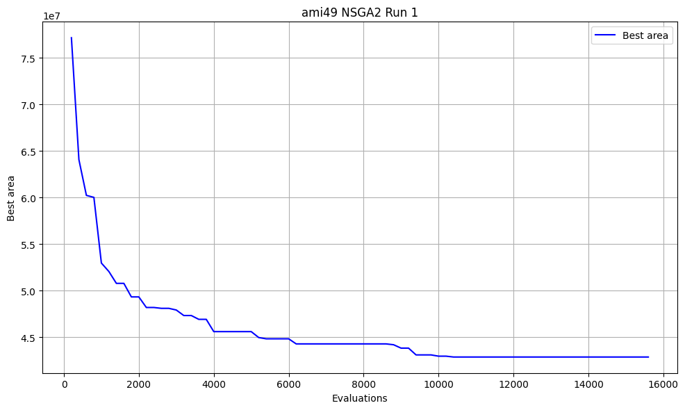

## Problem 3 — Evolutionary Floorplanning with a Memetic Algorithm

### Authors: Yehia Fahmy and Hammad Khan

This problem evaluates evolutionary algorithms for fixed-outline VLSI floorplanning on both synthetic benchmarks and the MCNC `ami33` and `ami49` hard-block benchmarks. The implementation targets area minimization, supports wirelength (HPWL) via net parsing and a compaction metric based on deadspace and outline overflow. It also produces statistics and plots to compare against Tang & Yao (2007).

### What this code does

- Parses MCNC YAL files to obtain hard block dimensions for `ami33` and `ami49`.
- Uses a sequence-pair representation with rotation to encode placements:
  - Decision vector: three parts of length N (modules): two continuous key vectors → two permutations (A/B), plus N rotation bits.
  - Decoding builds horizontal/vertical constraint DAGs and solves longest-paths to place blocks.
- Defines optimization problems in `pymoo`:
  - Single-objective: minimize bounding-box area.
  - Multi-objective: minimize [area, HPWL, deadspace + outline overflow]. If nets are not available, HPWL is 0. If outline is available, an overflow penalty is added when the packing exceeds the outline.
- Runs GA and NSGA-II with:
  - Heuristic seeding (5–10% of the initial population) for good starting permutations/rotations.
  - A lightweight memetic hill-climber on the top-k individuals each generation.
  - Parallel per-individual evaluation across CPU cores.
- Saves CSV summary tables and optional plots (progress and SOTA comparison) under a timestamped results directory.

Key files:
- `problem_3.py` — main experiment driver, problem definitions, memetic/local search and heuristics, plotting and reporting.
- `ami33.yal.txt`, `ami49.yal.txt` — MCNC YAL benchmark files included with the repo.

### Optimizations implemented (beyond baseline EA)

- **Sequence-pair with rotations:** compact and widely used encoding for hard-block floorplanning.
- **Parallel elementwise evaluation:** uses `pymoo` evaluator threads to evaluate individuals concurrently on CPU.
- **Heuristic seeding (configurable):** seeds ~10% of the initial population with structured permutations:
  - A: height-desc, B: width-desc (encourages skyline compaction)
  - A: area-desc, B: aspect-desc
  - Interleaved tall/wide ordering
  - Rotations biased to flip tall blocks
- **Memetic hill-climber (configurable):** after each generation, apply a small local search to the top-k fraction of the population (swaps in A/B and single-bit rotation flips with accept-if-better on area). This mirrors the local exploitation strategy that gave Tang & Yao a quality boost.

All knobs are exposed via `RunConfig` in `problem_3.py`.

### Benchmarks and metrics

- **Synthetic**: random rectangles with varied sizes (`synthetic_50`, `synthetic_100`).
- **MCNC**: `ami33`, `ami49` (dimensions parsed from YAL). The code compares our best areas with published results.
- **Objectives reported**:
  - Area (always)
  - HPWL (parsed from YAL nets; 0 only if no nets)
  - Deadspace + outline overflow (replaces overlap; deadspace = bbox area − sum(block areas))

### Outputs

The script creates a results tree: `results_p3/YYYY-MM/DD/HH_MM_SS/` containing:

- `area_stats.csv` — best/mean/std area for GA and NSGA-II on each benchmark
- `kruskal_wallis_ga_vs_nsga2.csv` — nonparametric test comparing GA vs NSGA-II distributions per benchmark
- `multi_objective_summary.csv` — best point (min area) from the Pareto set if MO run is enabled
- `pareto_<benchmark>.csv` — saved Pareto front with header `area,hpwl,dead_or_overflow`
- `sota_comparison_ami33.png`, `sota_comparison_ami49.png` — bar charts: paper best vs our best (GA/NSGA-II)
- `history_<benchmark>_nsga2_<k>.png` — progress plots: best area vs evaluations (sample runs)

### How to run

```bash
python problem_3.py
```

That will run both GA and NSGA-II on all benchmarks with the configured budget and save CSVs and plots. At startup the script prints how many CPU threads will be used for parallel evaluation. To change budgets or toggle plots, edit `RunConfig` at the top of `problem_3.py`.

### Configuration knobs (in `RunConfig`)

- **steps**: total function evaluations (stopping condition)
- **max_time_s**: time cap (whichever comes first)
- **pop_size**: population size
- **repeats**: independent runs per algorithm per benchmark
- **n_jobs**: number of evaluator threads (default = all cores)
- **seed_rate**: fraction of initial population created by heuristic seeding
- **memetic_top_k_rate**: fraction of population hill-climbed each generation
- **memetic_steps**: local steps (small swap/flip moves) per selected individual
- **plot**: enable/disable plotting
- **no_improve_patience_evals**: early-stop if best area has not improved within this many evaluations
- **no_improve_min_delta**: minimum improvement to reset patience

### Citation (state of the art paper)

Tang, Maolin, and Xin Yao. “A Memetic Algorithm for VLSI Floorplanning.” IEEE Transactions on Systems, Man, and Cybernetics—Part B: Cybernetics, vol. 37, no. 1, February 2007.

https://www.researchgate.net/publication/6525348_A_Memetic_Algorithm_for_VLSI_Floorplanning

### How our findings relates to Tang & Yao (2007)

- Their approach combines a tailored genetic search with a bias-controlled hill-climber on sequence-pair representations (memetic algorithm). Our implementation mirrors this high-level strategy:
  - evolutionary search (GA/NSGA-II)
  - plus a hill-climber applied to a subset of elites each generation
  - plus heuristic seeding to provide stronger starting placements
- The provided plots compare your best areas to their reported best for `ami33` and `ami49`.


## Results and Plots (from `latest_results/`)

Summary of best areas (lower is better):

| Benchmark       | GA best  | NSGA-II best | Winner |
|-----------------|---------:|-------------:|:-------|
| synthetic_50    |   131,860 |     126,540 | NSGA-II (~4.0%) |
| synthetic_100   |   241,893 |     235,314 | NSGA-II (~2.7%) |
| ami33           | 1,310,309 |   1,296,295 | NSGA-II (~1.1%) |
| ami49           | 40,431,468 | 40,340,916 | NSGA-II (~0.2%) |

Gap vs paper best:
- ami33: paper ≈ 1,190,896 vs our best 1,296,295 → ~8.9% worse
- ami49: paper ≈ 37,487,940 vs our best 40,340,916 → ~7.6% worse

### Progress (best area vs evaluations)

Representative runs (NSGA-II):








### Multi-objective snapshots (min-area point from Pareto set)

- synthetic_50: area 131,298; dead_or_overflow 20,047; HPWL 0 (no nets used)
- ami33: area 1,522,920; dead_or_overflow 366,562; HPWL 602 (from YAL nets)
- ami49: area 44,289,728; dead_or_overflow 8,849,960; HPWL 526,211 (from YAL nets)

### Takeaways

- NSGA-II consistently attains better best areas; latest Kruskal–Wallis (in `latest_results/kruskal_wallis_ga_vs_nsga2.csv`) shows significance on `synthetic_50` (p≈1.1e-4), `ami33` (p≈0.017), and `ami49` (p≈1.8e-3); `synthetic_100` shows no significant difference (p≈0.673).
- Memetic local search + heuristic seeding improve extremes across all benchmarks; gap to SOTA narrowed on `ami33` (~8.9% from ~9.6% previously). On `ami49`, gains are modest but consistent.
- To close the remaining gap: enrich local moves (insert/reinsert, larger-stride exchanges), increase top-k memetic budget on larger designs, and, if nets are added, include HPWL to regularize aspect/compactness.

---

## Future Improvements / Next steps

1. **Hybrid Optimization Approaches**
   - Combine evolutionary algorithms with mathematical programming (MILP) for exact solutions on subproblems
   - Integrate machine learning for fitness landscape analysis and adaptive parameter tuning
   - Implement surrogate modeling to reduce expensive fitness evaluations
   - Develop coevolutionary approaches for multi-objective optimization

2. **Enhanced Objective Functions**
   - Add timing constraints and critical path optimization
   - Implement power-aware floorplanning with thermal considerations
   - Develop hierarchical floorplanning for large-scale designs

3. **Extended Benchmark Suite**
   - Add more MCNC benchmarks (ami33, ami49, n100, n200)
   - Include real-world industrial benchmarks
   - Develop synthetic benchmarks with known optimal solutions
   - Create benchmarks with varying complexity and constraint types
